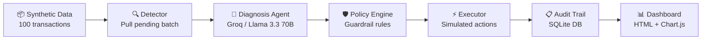

# ⚡ Winback — AI Payment Recovery Agent

> **Find revenue that's slipping away and win it back.**

Winback is a fintech AI agent that detects failed/at-risk payments, diagnoses why they failed using an LLM, applies deterministic guardrail policies, executes bounded recovery actions (simulated), and logs everything to a transparent audit trail — all visible through a real-time dashboard.

Built for the **Razorpay Buildathon — AI Revenue Recovery Track**.

---

## 🎯 Problem Statement

Revenue loss rarely happens in one clean step. A payment degrades, a checkout gets abandoned, a subscription fails, or an invoice goes overdue. Most platforms react too slowly or too aggressively — either letting revenue slip or spamming customers beyond compliance limits.

**Winback** closes the loop: detect → diagnose → decide → act → audit, with **AI handling the intelligence** and **deterministic guardrails enforcing the rules**.

---

## 🏗️ Architecture



```
┌─────────────────────────────────────────────────────────────────┐
│                        WINBACK PIPELINE                         │
├─────────┬──────────────┬──────────────┬───────────┬─────────────┤
│ DETECT  │  DIAGNOSE    │  GUARDRAIL   │  EXECUTE  │   AUDIT     │
│         │   (LLM)      │  (Rules)     │  (Sim)    │   (DB)      │
│ Pull    │  Groq API    │  Max retries │  retry    │  SQLite +   │
│ pending │  Llama 3.3   │  Mandate     │  link     │  Dashboard  │
│ txns    │  70B         │  window      │  WhatsApp │             │
│ by ₹    │              │  Contact     │  escalate │             │
│         │              │  limits      │  mark     │             │
└─────────┴──────────────┴──────────────┴───────────┴─────────────┘
```

### Key Design Decisions

| Decision | Rationale |
|----------|-----------|
| LLM only for diagnosis | AI recommends, but never directly executes — the policy engine is the gatekeeper |
| Deterministic guardrails | Compliance rules (NPCI mandate windows, contact limits) must be 100% predictable |
| Highest-amount-first ordering | Prioritize the biggest revenue-at-risk items in each batch |
| Simulated execution | No real payment gateway integration — success rates model realistic conversion |

---

## 🛡️ Guardrail Rules

The policy engine enforces three critical rules:

| # | Rule | Trigger Condition | Override Action |
|---|------|-------------------|-----------------|
| 1 | **Max Retry Limit** | `attempt_number > 3` | `mark_unrecoverable` |
| 2 | **NPCI Mandate Window** | `type == subscription_renewal` AND past `mandate_window_end` AND action is `retry_payment` | `send_payment_link` |
| 3 | **Contact Limit** | `customer_contact_count_48h >= 2` AND action is `send_reminder_whatsapp` or `send_payment_link` | `escalate_to_human` |

If no rule fires → action is approved as-is.

---

## 🚀 Setup & Run

### Prerequisites
- Python 3.11+
- A free Groq API key (get one at [console.groq.com](https://console.groq.com))

### 1. Install Dependencies

```bash
cd Winback
pip install -r requirements.txt
```

### 2. Set Environment Variable

```bash
# Linux/macOS
export GROQ_API_KEY=your_groq_api_key_here

# Windows PowerShell
$env:GROQ_API_KEY="your_groq_api_key_here"

# Or create a .env file:
cp .env.example .env
# Then edit .env and paste your key
```

### 3. Generate Synthetic Data

```bash
python generate_data.py
```

This creates `winback.db` with 100 synthetic failed transactions across all failure types, with 25%+ designed to trigger guardrail rules.

### 4. Start the Backend

```bash
uvicorn app:app --reload --port 8000
```

The API will be available at `http://localhost:8000`.

### 5. Serve the Frontend

```bash
# From the project root — use any static file server:
cd frontend
python -m http.server 3000
```

Open `http://localhost:3000` in your browser.

### 6. Run the Demo

1. Open the dashboard at `http://localhost:3000`
2. You'll see 100 pending transactions with their failure codes
3. Click **"▶ Run Recovery Batch"**
4. Watch the stats update: recovery rate, guardrails fired, amounts recovered
5. Scroll through the audit log — look for 🛡️ guardrail badges (yellow = blocked/overridden)
6. Click **"🔄 Reset Data"** to re-seed and run again

---

## 📡 API Endpoints

| Method | Endpoint | Description |
|--------|----------|-------------|
| `GET` | `/` | Health check |
| `GET` | `/transactions` | All transactions with current state |
| `GET` | `/summary` | Summary stats (totals, rates, counts) |
| `POST` | `/run-batch` | Run the full recovery pipeline on pending transactions |
| `POST` | `/reset` | Re-seed database with fresh synthetic data |

---

## 📂 Project Structure

```
Winback/
├── app.py                  # FastAPI backend + orchestrator endpoint
├── models.py               # SQLAlchemy models + DB setup
├── generate_data.py        # Synthetic data generator (100 txns)
├── detector.py             # Step 2: Pull pending batch
├── diagnosis.py            # Step 3: LLM diagnosis via Groq
├── policy.py               # Step 4: Guardrail / policy engine
├── executor.py             # Step 5: Simulated action executor
├── requirements.txt        # Python dependencies
├── .env.example            # Environment variable template
├── README.md               # This file
└── frontend/
    └── index.html          # Single-page dashboard (HTML + CSS + JS + Chart.js)
```

---

## 🔮 What We'd Add With More Time

- **Real payment gateway webhooks** — integrate with Razorpay/Stripe for actual retry execution
- **More failure types** — UPI declines, NEFT timeouts, international card failures
- **Multi-language reminders** — WhatsApp messages in Hindi, Tamil, etc.
- **Webhook-driven triggers** — react to payment failures in real-time instead of batch mode
- **Customer risk scoring** — ML model to predict recovery likelihood per customer
- **A/B testing framework** — compare recovery strategies (e.g., WhatsApp vs SMS vs email)
- **Role-based access control** — separate dashboards for ops, finance, and compliance teams
- **Retry scheduling optimization** — use ML to find the optimal time-of-day for retries
- **Configurable guardrails** — admin UI to adjust policy rules without code changes
- **Promise-to-pay tracking** — let customers commit to a future payment date
- **Export & reporting** — CSV/PDF export of audit trails for compliance reporting

---

## 🧰 Tech Stack

| Layer | Technology |
|-------|------------|
| Backend | Python 3.11, FastAPI |
| Database | SQLite (via SQLAlchemy) |
| LLM | Groq API — Llama 3.3 70B Versatile |
| Frontend | HTML, CSS, JavaScript, Chart.js |
| Fonts | Inter, JetBrains Mono (Google Fonts) |

---

## 📝 License

Built for Razorpay Buildathon 2026. MIT License.
